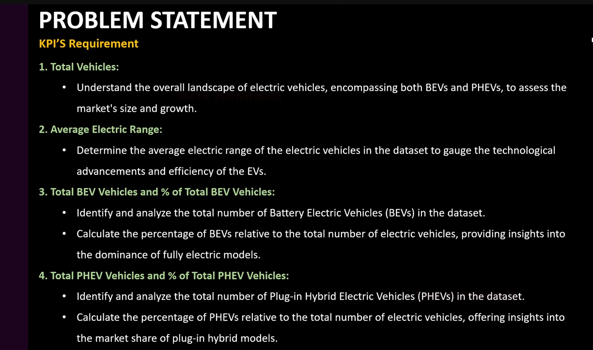

# Electric-Vehicles
This project provides an in-depth analysis of electric vehicle (EV) data, including various car types, their electric ranges, and the number of vehicles for each model. The data is visualized in Tableau is user-customizable and interactive.

Electric Vehicle Requirments : 

Electric Vehicles DashBoard: 

